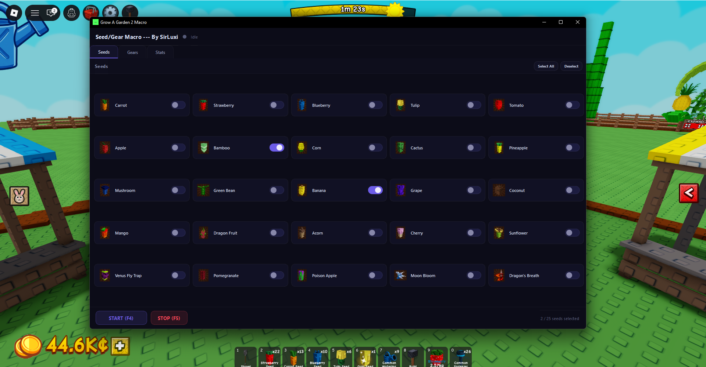

#  🌱 Grow A Garden 2 Macro

---

<!-- Replace the line below with your actual screenshot once uploaded (see the Screenshot Guide section) -->
<--  -->

### Usage
1. Load into **Grow A Garden 2** in Roblox
2. Select your seeds and gears
3. 2. Press **Start Macro**  and step away

| Hotkey | Action |
|--------|--------|
| `F4` | Start|
| `F5` | Stop|

*Built by SirLuxi*

